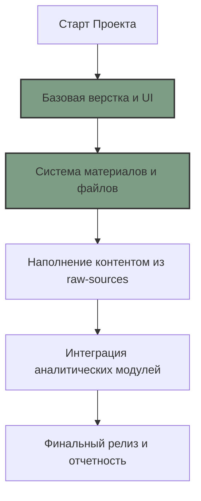

# 🗺 ДОРОЖНАЯ КАРТА (ROADMAP)

## 📍 ТЕКУЩИЙ ЭТАП: [ЭТАП 3 - Наполнение контентом]
- Интеграция данных команды завершена.
- База знаний (Wiki) синхронизирована с кодом.
- Подготовка к интеграции аналитических модулей (Wordstat).

## 🚀 СЛЕДУЮЩИЕ ШАГИ
1. **Интеграция Wordstat**: Перенос очищенных данных из `wiki/data/` в интерактивные графики на сайте.
2. **Аналитический блок**: Создание раздела с результатами прогнозирования и корреляционного анализа.
3. **Финальная полировка**: Проверка всех ссылок и адаптивности перед сдачей этапа.
