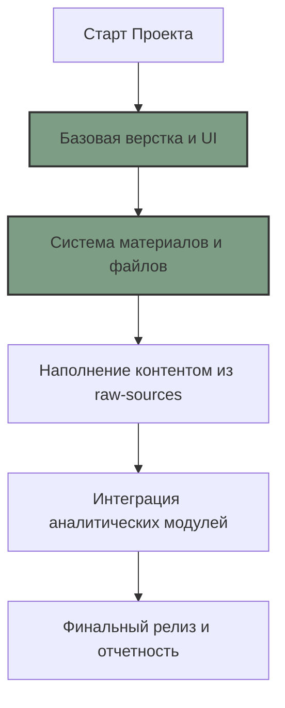

# 🗺 ДОРОЖНАЯ КАРТА (ROADMAP)

## 📍 ТЕКУЩИЙ ЭТАП: [ЭТАП 2 - Система материалов]
- Завершение настройки вложенных страниц.
- Подготовка структуры для реальных файлов (Методология, Данные, Статьи).

## 🚀 СЛЕДУЮЩИЕ ШАГИ
1. **Ingest данных**: Систематизация материалов из папки `/raw-sources/` и перенос их в Wiki и на сайт.
2. **Интерактив**: Добавление реальных ссылок на облачные хранилища или локальные файлы для скачивания.
3. **Мобильная оптимизация**: Финальная проверка адаптивности плиток на смартфонах.
